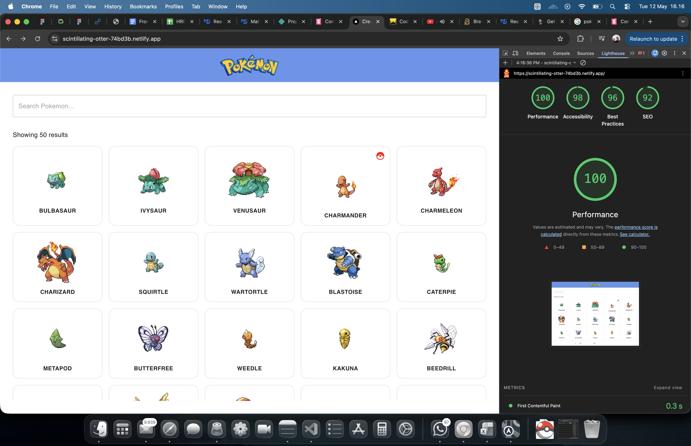
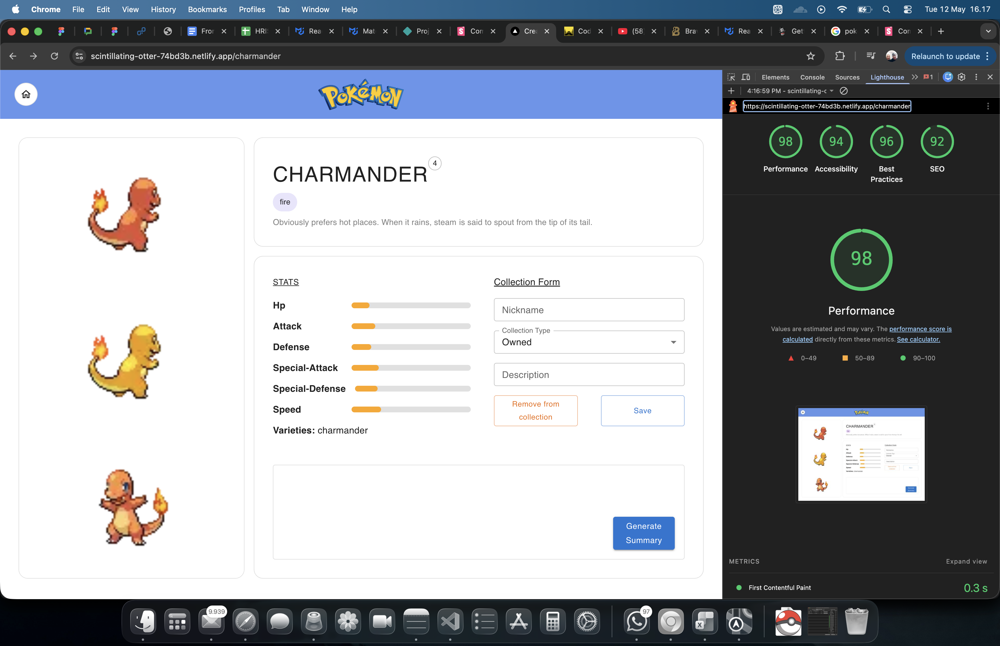

# Poke Test

A Pokedex app built with Next.js (App Router), MUI, Axios.

Web: https://scintillating-otter-74bd3b.netlify.app/
Storybook: https://astounding-cat-c25c74.netlify.app/

## Structure

```txt
app/                       # routes/layouts
  page.tsx                 # home (pokemon list + search)
  [name]/page.tsx          # pokemon detail

features/                  # feature modules (business logic + UI)
  home/
  pokemon/

lib/                       # shared stuff (hooks/constants/utils)
public/                    # static assets
stories/ + .storybook/     # Storybook
```

## Getting Started

```bash
npm i
```

Copy env file (optional):

```bash
cp .env.example .env.local
```

Run dev server:

```bash
npm run dev
```

Build & start production:

```bash
npm run build
npm run start
```

## Tests & Lint

```bash
npm test              # run unit tests
npm run test:watch    # watch mode
npm run lint          # lint
```

## Storybook

```bash
npm run storybook
```

## APIs Used

Endpoints (PokeAPI v2):

- `GET /pokemon?limit=<number>&offset=<number>`: list pokemons (home page)
- `GET /pokemon/<name>`: pokemon detail
- `GET /pokemon-species/<name>`: pokemon lore/species info

## Lighthouse Docs



